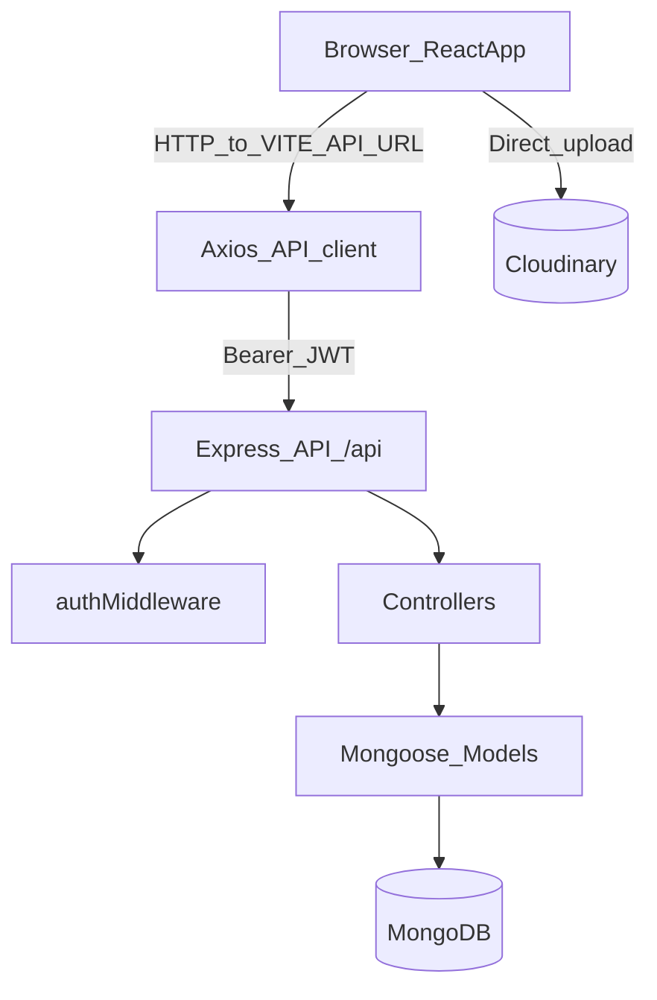

# Forums-WebApp Architecture

This repo is a deployed MERN-style app split into:

- **Frontend**: Vite + React (static site)
- **Backend**: Express + Mongoose (web service API)

## Repo layout

```
.
├── backend/
│   └── src/
│       ├── config/          # Mongo connection
│       ├── controllers/     # request handlers
│       ├── middleware/      # JWT auth middleware
│       ├── models/          # Mongoose schemas
│       ├── routes/          # Express routers
│       └── server.js        # app entrypoint
├── frontend/
│   └── src/
│       ├── api/             # Axios client
│       ├── components/      # UI components
│       ├── context/         # AuthContext
│       ├── pages/           # route pages
│       └── utils/           # Cloudinary upload helper
└── docs/
```

## Backend overview

- **Entrypoint**: `backend/src/server.js`
- **CORS**: allows a single origin (`FRONTEND_URL`), defaults to `http://localhost:5173`
- **Routes** (mounted under `/api`):
  - `/api/users` → auth + user CRUD
  - `/api/forums` → forum CRUD
  - `/api/threads` → thread CRUD
- **Auth**: JWT via `Authorization: Bearer <token>` header (`backend/src/middleware/authMiddleware.js`)

### Data models (Mongo)

- **User** (`backend/src/models/User.js`)
  - `username`, `password` (hashed on save), `pictureUrl`, `role`, `creationTime`
- **Forum** (`backend/src/models/Forum.js`)
  - `creatorUserId`, `topic`, `description`, `forumPic`, `creationTime`
- **Thread** (`backend/src/models/Thread.js`)
  - `userId` (ref User), `forumId` (ref Forum), `description`, `upvotesNum`, `downvotesNum`, `creationTime`

### API surface (quick reference)

- **Auth**
  - `POST /api/users/register` → `{ user: { id, username, role, pictureUrl }, token }`
  - `POST /api/users/login` → `{ user: { id, username, role, pictureUrl }, token }`

- **Users**
  - `GET /api/users` (public)
  - `GET /api/users/:id` (public)
  - `PUT /api/users/:id` (auth; admin or self)
  - `DELETE /api/users/:id` (auth; admin or self)

- **Forums**
  - `GET /api/forums` (public)
  - `GET /api/forums/:id` (public)
  - `POST /api/forums` (auth)
  - `PUT /api/forums/:id` (auth; admin or forum owner)
  - `DELETE /api/forums/:id` (auth; admin or forum owner; cascades delete threads in forum)

- **Threads**
  - `GET /api/threads` (public; returns all threads sorted by newest; populates `userId` with `username` and `pictureUrl`)
  - `GET /api/threads/:id` (public)
  - `POST /api/threads` (auth; backend overwrites/sets `userId` from JWT)
  - `PUT /api/threads/:id` (auth; admin or thread owner)
  - `DELETE /api/threads/:id` (auth; admin or thread owner)

## Frontend overview

- **Router**: `frontend/src/App.jsx`
  - `/` home
  - `/login`
  - `/register`
  - `/forums`
  - `/forums/:id`
  - `/profile`
- **Auth state**: `frontend/src/context/AuthContext.jsx`
  - stored in `localStorage` as `user` + `token`
- **API client**: `frontend/src/api/api.js`
  - `baseURL = VITE_API_URL || http://localhost:5000/api`
  - attaches `Authorization` header automatically if `localStorage.token` exists
- **Uploads**: direct browser upload to Cloudinary (`frontend/src/utils/uploadToCloudinary.js`)

## Request flow



## Known quirks / gotchas

- **Threads are fetched globally**: `frontend/src/pages/ForumDetailPage.jsx` uses `GET /api/threads` and filters client-side (no backend endpoint like `GET /api/forums/:id/threads`).
- **Thread image mismatch**: backend `threadController.updateThread` references `pictureUrl`, but the `Thread` schema does not define `pictureUrl` (so thread images are not currently supported end-to-end).

